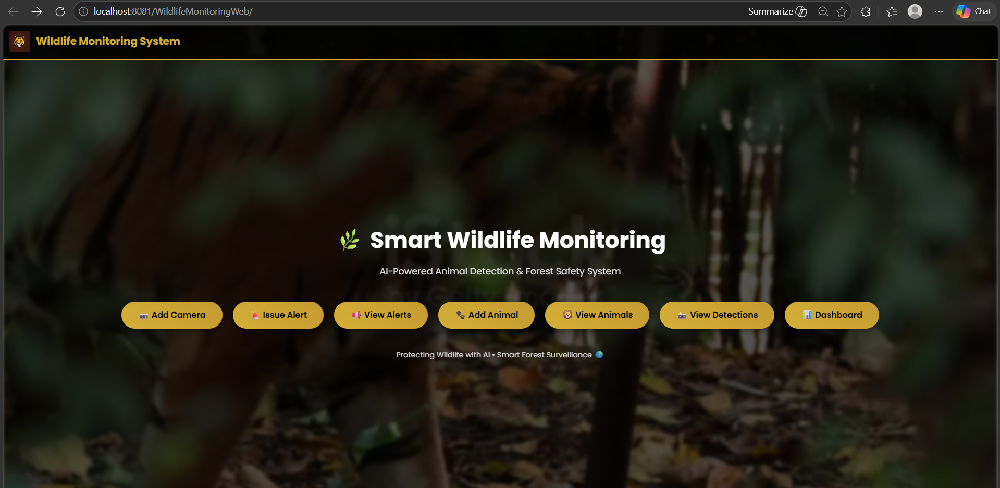
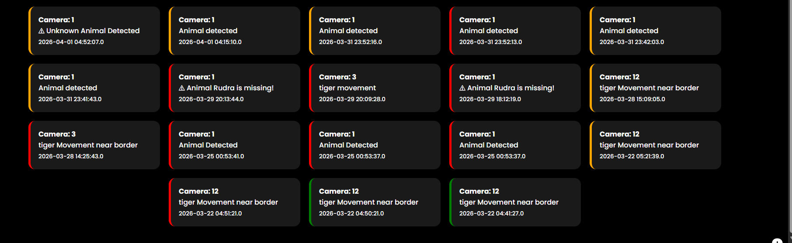
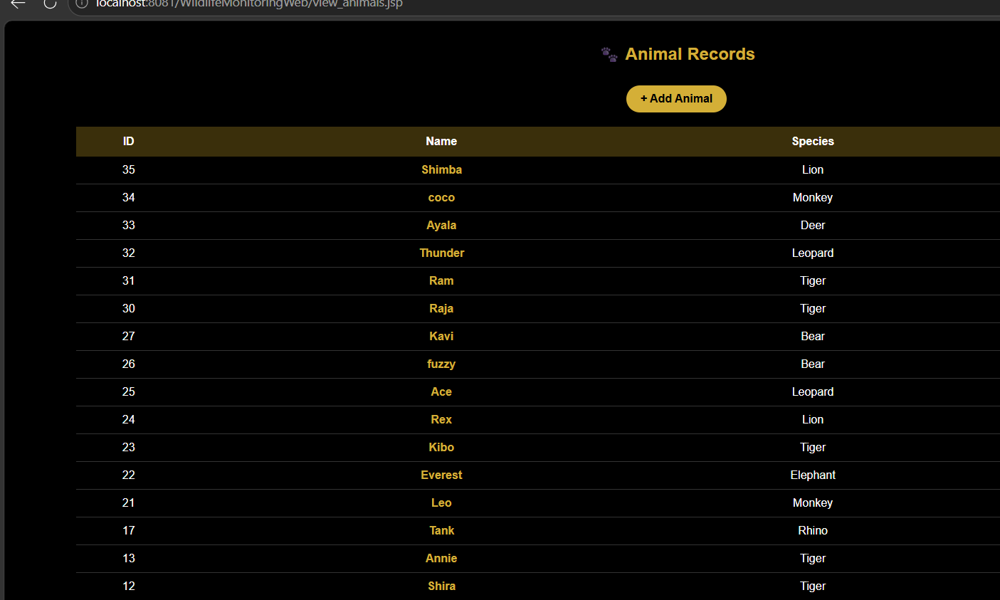
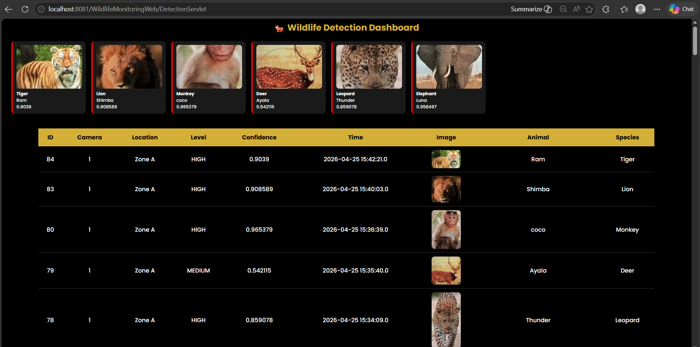
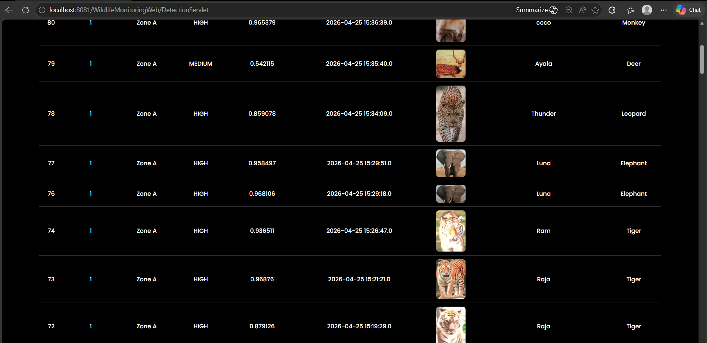
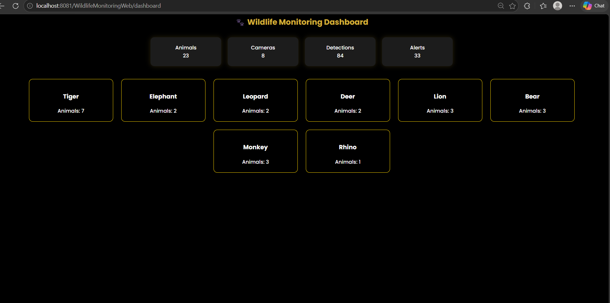
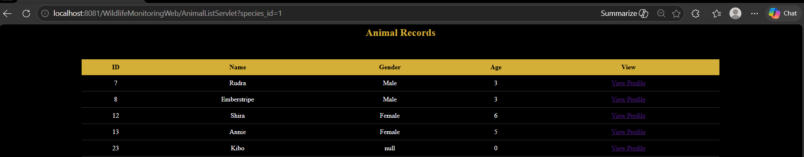

# Wildlife Monitoring & Animal Identification System

An AI-powered wildlife monitoring system that detects, identifies, and tracks animals in real time using Computer Vision, Deep Learning, Java, and Python.

This project started as a Tiger Detection System and was later extended into a multi-species wildlife monitoring platform capable of tracking individual animals over time.

---

# Project Overview

The main goal of this project is to reduce manual wildlife monitoring efforts by automating:

* Animal detection
* Animal identification
* Detection tracking
* Activity analysis
* Monitoring dashboards

Instead of only detecting animals in images or video streams, the system also tries to identify whether the detected animal has been seen before.

The idea is similar to:

> "Face recognition, but for animals."

---

# Features

## Real-Time Animal Detection

The system uses a YOLOv8 model to detect animals from camera feeds or uploaded images.

Currently supported species:

* Tiger
* Elephant
* Leopard
* Deer
* Lion
* Bear
* Monkey
* Rhino

Each detection stores:

* Species name
* Confidence score
* Detection time
* Camera/location information
* Detection image

---

## Animal Re-Identification (Re-ID)

After detection, the system extracts deep feature embeddings using ResNet50.

These embeddings are compared with previously stored embeddings using cosine similarity.

### Matching Logic

* If similarity is above a threshold:

  * Existing animal is identified
  * Previous animal ID is reused

* If similarity is below threshold:

  * Animal is treated as new
  * Can be registered manually

This allows the system to track animals across multiple detections.

---

## Automatic Animal Identification

Once an animal is registered, the system remembers it.

Future detections are automatically matched and linked to the same animal profile.

This significantly reduces manual work.

---

## Cooldown Logic

A cooldown mechanism prevents duplicate detections.

If the same animal is detected repeatedly within a short time window, the system avoids storing unnecessary duplicate entries.

This helps keep the database cleaner and improves monitoring quality.

---

## Animal Activity Tracking

Each animal profile contains:

* Complete detection history
* Last seen location
* Last seen timestamp
* Detection confidence history
* Activity graph

The system also tracks animal activity status:

* ACTIVE
* LOW ACTIVITY
* MISSING

### Missing Logic

If an animal is not detected for more than 3 hours, the system marks it as:

> MISSING

---

## Species-Wise Dashboards

The project contains dedicated dashboards for different species.

Each animal profile page displays:

* Animal information
* Detection timeline
* Detection images
* Activity graph
* Status information

---

## Alert System

The system includes confidence-based alert levels:

* LOW
* MEDIUM
* HIGH

High-confidence detections can trigger alerts or siren systems for monitoring purposes.

---

# Screenshots & Demo

## Homepage

The main landing page with quick access to all system features including Add Camera, Issue Alert, View Alerts, Add Animal, View Animals, View Detections, and Dashboard.

## Alerts Dashboard

Real-time alert monitoring showing all detected animal activities with timestamps, camera locations, and alert levels (indicated by different border colors).

## Animal Records

Complete list of all registered animals in the system with their ID, name, and species classification. Users can easily manage and view animal profiles.

## Detection Dashboard with Thumbnails

Visual dashboard showing detected animals with their thumbnails, confidence scores, and species identification. Displays the most recent detections at a glance.

## Detection History Table

Detailed table view of all detections with comprehensive information including ID, camera number, location, confidence level, timestamp, detection image, animal name, and species.

## Monitoring Dashboard

High-level overview dashboard displaying key statistics:
- Total Animals: 23
- Total Cameras: 8
- Total Detections: 84
- Total Alerts: 33

Species breakdown showing animal count for each species (Tiger, Elephant, Leopard, Deer, Lion, Bear, Monkey, Rhino).

## Species Filter - Tiger Records

Species-specific animal records showing all tigers registered in the system with their ID, name, gender, age, and profile view options.

---

# System Workflow

Camera Feed / Image
↓
YOLOv8 Detection
↓
Animal Crop Extraction
↓
ResNet50 Embedding Generation
↓
Cosine Similarity Matching
↓
Database Storage
↓
Dashboard & Activity Monitoring

---

# Tech Stack

## AI / Machine Learning

* YOLOv8 (Ultralytics)
* ResNet50
* PyTorch
* OpenCV
* NumPy
* Scikit-learn

## Backend

* Java Servlets
* JSP
* JDBC

## Database

* MySQL

## Frontend

* HTML
* CSS
* JavaScript

## Training Environment

* Google Colab (GPU)

---

# Database Design

## animals

Stores registered animal information.

### Important Fields

* animal_id
* animal_name
* species_id
* last_seen_time
* last_seen_location
* embedding

---

## detections

Stores all detection records.

### Important Fields

* detection_id
* camera_id
* species_id
* animal_id
* confidence
* image_path
* detected_at

---

## species

Stores species information.

### Important Fields

* species_id
* species_name

---

# Challenges Faced

Some of the major challenges while building this system:

* Low model accuracy during initial YOLO training
* Handling similar-looking animals
* Designing embedding matching logic
* Managing Java + Python integration
* Preventing duplicate detections
* Handling real-time updates and dashboard synchronization

---

# What I Learned

This project helped me understand that building AI models is only one part of a real-world system.

The bigger challenge is:

* system integration
* scalability
* reliability
* data handling
* real-time processing

I also learned how AI systems interact with backend services and databases in practical applications.

---

# Future Improvements

Some planned improvements:

* Multi-embedding matching for better accuracy
* Better dataset and longer training
* Multi-camera animal tracking
* Mobile alerts (SMS/WhatsApp)
* GPS integration
* Improved species-specific identification models

---

# Project Status

Current Status:

* Detection system completed
* Dashboard completed
* Animal profile tracking completed
* Re-identification system working
* Multi-species support added
* Activity monitoring added

Further improvements are ongoing.

---

# Mentor Acknowledgement

I sincerely appreciate the guidance, mentorship, and valuable feedback from Dr. Ravikumar R Natarajan throughout this project journey.

---

# Author

Tanvi Sharma

AI | Computer Vision | Full Stack Development | Wildlife Monitoring Systems
